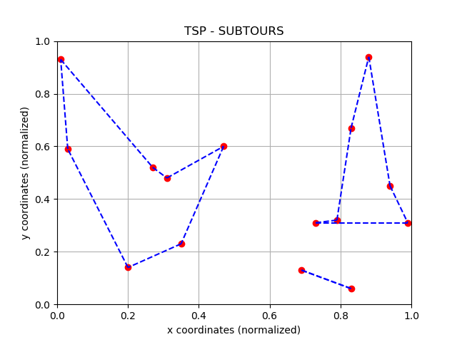
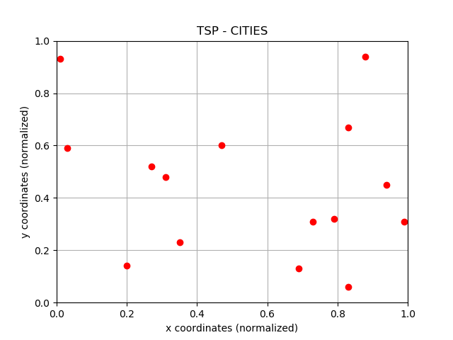
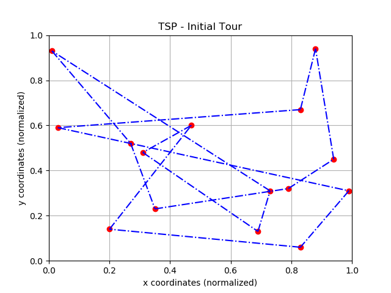
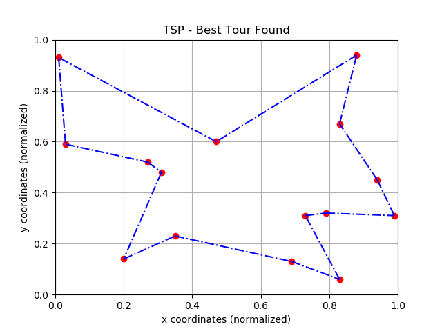
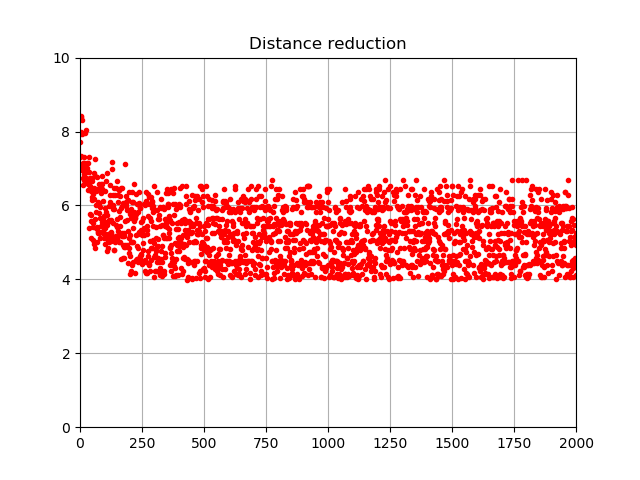
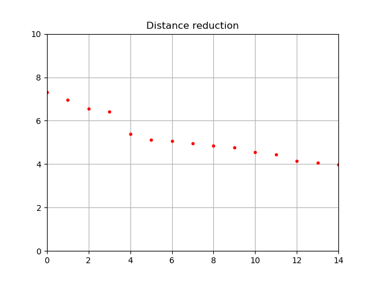

## ex12-14-traveling-salesman-problem-fernandoorge

### Table of contents
* [Repo organization](#repo-organization)
* [Solution to exercise 12](#solution-to-exercise-12)
* [Solution to exercise 13](#solution-to-exercise-13)
* [Solution to exercise 14](#solution-to-exercise-14)

### Repo organization

Each exercise of the assignment is solved in a different file
* **ex12.py** for exercise 12
* **ex13.py** for exercise 13
* **ex14.py** for exercise 14
* **logistics.py** constains some useful functions developed by me. 


### Solution to exercise 12
```
1) Try to solve the TSP with a LP matching model. 
   Use the scipy.linprog package. 
   For the cities coordinates use random points.
```

The random cities are shown below


```
2) Plot the resulting network with the matplotlib library.
```

The results are shown below




```
3) Understand the outputs. What happend to the optimal path?
4) What are the alternatives to this formulation and their disadvantages?
```

This is the solution I found to this particular problem
* The minimum distance will be : 4.03 

The connections between different cities are shown below
* 0 represents no connection
* 1 represents connections

```
            Node    i : [  0    1    2    3    4    5    6    7    8    9   10   11   12   13   14]
    Node  0 conection : [0.0, 0.0, 0.0, 1.0, 0.0, 0.0, 0.0, 0.0, 0.0, 0.0, 0.0, 0.0, 0.0, 0.0, 0.0]
    Node  1 conection : [0.0, 0.0, 0.0, 0.0, 0.0, 1.0, 0.0, 0.0, 0.0, 0.0, 0.0, 0.0, 0.0, 0.0, 0.0]
    Node  2 conection : [0.0, 1.0, 0.0, 0.0, 0.0, 0.0, 0.0, 0.0, 0.0, 0.0, 0.0, 0.0, 0.0, 0.0, 0.0]
    Node  3 conection : [0.0, 0.0, 1.0, 0.0, 0.0, 0.0, 0.0, 0.0, 0.0, 0.0, 0.0, 0.0, 0.0, 0.0, 0.0]
    Node  4 conection : [0.0, 0.0, 0.0, 0.0, 0.0, 0.0, 0.0, 0.0, 0.0, 0.0, 0.0, 0.0, 1.0, 0.0, 0.0]
    Node  5 conection : [0.0, 0.0, 0.0, 0.0, 0.0, 0.0, 0.0, 0.0, 0.0, 0.0, 0.0, 1.0, 0.0, 0.0, 0.0]
    Node  6 conection : [0.0, 0.0, 0.0, 0.0, 0.0, 0.0, 0.0, 0.0, 0.0, 0.0, 1.0, 0.0, 0.0, 0.0, 0.0]
    Node  7 conection : [0.0, 0.0, 0.0, 0.0, 1.0, 0.0, 0.0, 0.0, 0.0, 0.0, 0.0, 0.0, 0.0, 0.0, 0.0]
    Node  8 conection : [0.0, 0.0, 0.0, 0.0, 0.0, 0.0, 0.0, 0.0, 0.0, 0.0, 0.0, 0.0, 0.0, 0.0, 1.0]
    Node  9 conection : [0.0, 0.0, 0.0, 0.0, 0.0, 0.0, 0.0, 0.0, 1.0, 0.0, 0.0, 0.0, 0.0, 0.0, 0.0]
    Node 10 conection : [0.0, 0.0, 0.0, 0.0, 0.0, 0.0, 1.0, 0.0, 0.0, 0.0, 0.0, 0.0, 0.0, 0.0, 0.0]
    Node 11 conection : [1.0, 0.0, 0.0, 0.0, 0.0, 0.0, 0.0, 0.0, 0.0, 0.0, 0.0, 0.0, 0.0, 0.0, 0.0]
    Node 12 conection : [0.0, 0.0, 0.0, 0.0, 0.0, 0.0, 0.0, 0.0, 0.0, 0.0, 0.0, 0.0, 0.0, 1.0, 0.0]
    Node 13 conection : [0.0, 0.0, 0.0, 0.0, 0.0, 0.0, 0.0, 0.0, 0.0, 1.0, 0.0, 0.0, 0.0, 0.0, 0.0]
    Node 14 conection : [0.0, 0.0, 0.0, 0.0, 0.0, 0.0, 0.0, 1.0, 0.0, 0.0, 0.0, 0.0, 0.0, 0.0, 0.0]
```

As shown in the previous picture, the solution has 3 subtours
```
    Subtour found: [0, 3, 2, 1, 5, 11]
    Subtour found: [4, 12, 13, 9, 8, 14, 7]
    Subtour found: [6, 10]
```

This solution satisfies all the restrictions, and also has minimum distance, but that's not exactly what we need to entirely solve this problem, because we're looking for a single tour, and not a set of subtours.

A simple way to convert this set of subtours into a single tour is to connect the last city of any given subtour to the first city of another subtour, for example
```
    Subtour found: [0, 3, 2, 1, 5, 11, 4, 12, 13, 9, 8, 14, 7]
    Subtour found: [6, 10]
```
and then we have to connect the remaining subtours
```
    Subtour found: [0, 3, 2, 1, 5, 11, 4, 12, 13, 9, 8, 14, 7, 6, 10]
```
However, this solution won't be optimal but it can be improved using an appropiate algorithm, such as GRASP.

### Solution to exercise 13
```
1) Solve the TSP with an original implementation of the Genetic Algorithm (GA).
```
Work in progress...

### Solution to exercise 14
```
1) Solve the TSP with an original implementation of the 
   Greedy Randomize AdaptiveSearch Procecure (GRASP).
```

The same set of cities is used for this exercise. All the cities are shown below.



Since the graph is assumed to be complete (i.e. each point is adjacent to each other), a trivial solution is obtained by visiting each node in increasing order, as shown below

```
    Initial tour: [0, 1, 2, 3, 4, 5, 6, 7, 8, 9, 10, 11, 12, 13, 14]
    Initial tour distance = 7.322600
```




By applying GRASP METHOD, this is the best solution found after **2000 iterations**.



```
    New tour [3, 2, 8, 12, 4, 13, 9, 7, 14, 10, 6, 11, 0, 5, 1]
    Tour distance = 3.988678
``` 

If we took the distances at each iteration of the GRASP Method, we got the following figure



Where we can see that there's no iteration that can obtain a distance lower than 4 units (approximately), and also we can see that the algorithm converges to that value in (approximately) 250 iterations.

If we only considered those iterations where we obtained a better distance (a lower than the previous one), we can see that (see picture below) that only **14 out of 2000 iterations** are getting a better distance.


